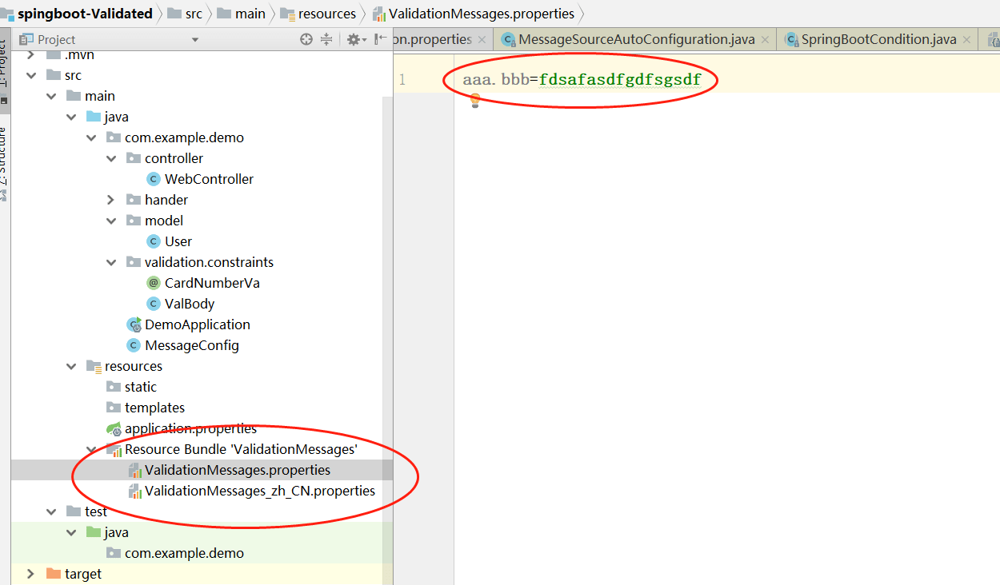

# Spring Boot 验证 #

* 主要内容
  * Bean Validation（JSR-303）：介绍 Java Bean 验证、核心 API、实现框架 Hibernate Validator
  * Apache commons-validator ：介绍最传统 Apache 通用验证器框架，如：长度、邮件等方式
  * Spring Validator：介绍 Spring 内置验证器 API、以及自定义实现


## [小马哥的github](https://github.com/mercyblitz/) ##


## Maven 依赖 ##

```
		<dependency>
			<groupId>org.springframework.boot</groupId>
			<artifactId>spring-boot-starter-validation</artifactId>
		</dependency>
 ``` 
 > Mi那个命规则（从1.4版本开始）Spring Boot 
 大多数采用starter（启动器，包含一些自动装配的Spring组件），官方的命名规则
 spring-boot-starter-{name}，业界或者民间：{name}-spring-boot-starter  
 
 
## 常用的验证技术

### 注解方式
 ```
 
 public class User {

    @Max(value = 100)
    private long id;
    @NotNull
    private String name;
}
 
   @RequestMapping("saveUser.do")

    public User save(@Validated User user) {
        return user;
    }

 ```


###    Spring Assert.notNull(user.getName(),"名称不能为空");

###    assert user.getId()<100; （JVM）

> 以上的方式，耦合了业务逻辑

###    SpringMvc 做拦截(实现也是非常麻烦的)
```
public class MyIncepertor implements HandlerInterceptor{
    @Override
    public boolean preHandle(HttpServletRequest request, HttpServletResponse response, Object handler) throws Exception {
        //把校验逻辑放在这里
        return true;
    }
}
```
### Aop 做拦截
  
  

### 自定义 Bean Validation

     需求：通过前缀来验证（带abc），后缀必须是数字
 
   ####  实现步骤 
   
   1. 复制成熟的validation.constraints 的标签
   
   ```
   @Target({FIELD})
@Retention(RUNTIME)
@Documented
@Constraint(validatedBy = {})
  
  ------------------------------  
    
@Target({FIELD})
@Retention(RUNTIME)
@Documented
@Constraint(validatedBy = {ValBody.class})
public @interface CardNumberVa {
    String message() default "{aaa.bbb}";
    Class<?>[] groups() default { };

    Class<? extends Payload>[] payload() default { };
}
    
    
package com.example.demo.validation.constraints;

import org.springframework.util.StringUtils;

import javax.validation.ConstraintValidator;
import javax.validation.ConstraintValidatorContext;

public class ValBody implements ConstraintValidator<CardNumberVa,String> {
    @Override
    public void initialize(CardNumberVa constraintAnnotation) {

    }

    @Override
    public boolean isValid(String value, ConstraintValidatorContext context) {

        //为什么不实用split ，原因是在于使用了正则表达式，性能也相对较弱
        //npe保护不够
        //如果没有依赖的情况下，使用 StringTokenizer（不足类似于枚举）
        String[] parts = StringUtils.delimitedListToStringArray(value, "-");
        if(parts.length!=2){
            return false;
        }
        return true;
    }
}

自定义注解引用：
import com.example.demo.validation.constraints.CardNumberVa;

import javax.validation.constraints.Max;
import javax.validation.constraints.NotNull;

public class User {

    @Max(value = 100)
    private long id;
    @NotNull
    private String name;
    @CardNumberVa
    private String cardNumber;//必须满足自己所定义的条件


    public long getId() {
        return id;
    }

    public void setId(long id) {
        this.id = id;
    }

    public String getName() {
        return name;
    }

    public void setName(String name) {
        this.name = name;
    }

    public String getCardNumber() {
        return cardNumber;
    }

    public void setCardNumber(String cardNumber) {
        this.cardNumber = cardNumber;
    }
}

    
   ```


国际化显示错误信息：

参考路径：\org\hibernate\validator\hibernate-validator\6.0.12.Final\hibernate-validator-6.0.12.Final.jar!\org\hibernate\validator\ValidationMessages_zh_CN.properties

文件名称：ValidationMessages.properties/ValidationMessages_zh_CN.properties/...